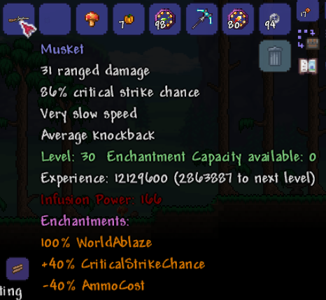
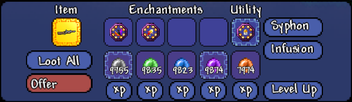

# Weapon Enchantments

# Features
*Item Customization (Enchantments)
*Progression System (Item Experience)
*Item Upgrading (Infusion)

Terraria has you frequently swapping old gear for new. The enchanting system allows you to customize your weapons and armor, and keep your progress as you change or upgrade your gear.

# Wiki

## Enchantments

Enchantments allow customization of your items:
    Basic stat upgrades such as:
        *Damage
        *Critical strike chance
        *Armor
        *Life steal
    More unique upgrades such as:
        *Hitting all enemies in an area (One for All)
        *Dealing massive damage but having a long recovery (All for One)
        *Flames that spread between enemies (World Ablaze)
        *Max health true damage (God Slayer)

Each enchantment has a capacity cost.  This cost is subtracted from the item enchantment capacity.

They're obtained by...
* Crafting (Only Damage and Armor)
* Looting chests.
* Defeating enemies.

Most enchantments can be upgraded with a new containment and some essence.

There are 5 tiers:
0. Basic
1. Medium
2. Rare
3. Super Rare
4. Ultra Rare
> Some enchantments are tier 4 exclusive, as is the case of the Spelunkner Enchantment. (This is temporary until the mechanics are in place to have lower tiers.)

## Item Experience
All weapons, armor and accesories can now gain experience (**XP**). These are **enchantable items**.

These items have a level based on their XP and all enchantable items have an enchantment capacity proportional to their tier.

You can obtain XP by damaging enemies, doing skilling activities such as mining and cutting trees, and consuming essence.

> Items with no XP will not display experience or levels.

## Crafting and Upgrading Enchantments
### Essence

This is the mod's main currency. They represent solidified experience and are automatically stored in the enchanting table inventory (like a piggy bank).
They can be used to...
* Upgrade enchantments.
* Infuse it's XP value into items.

There are 5 Essence types, each worth more than the last:
1. Basic
2. Common
3. Rare
4. Super Rare
5. Ultra Rare

### Containments

These contain the power of the enchantments.  More powerful enchantments require larger and stronger containments to hold them.

There are 3 containment levels:
1. Containment (Silver or Tungsten)
2. Medium Containment (Gold or Platinum)
3. Superior Containment (Demonite or Crimtane)

## Power Boosters
These are rare items obtained by defeating bosses, and add 10 levels over your item's level, without adding on to the level cost. They can be used only once per item and are returned upon offering the item.

## Enchanting Table

This is the mod's main station. All of the essence you pick up are stored here. Right clicking the enchanting table opens the enchanting interface. In an enchanting table you can...
* Create enchantments.
* Upgrade enchantments.
* Infuse essence into items (to level them up).
* Enchant (or disenchant) items.
* Offer items (equivalent of selling).
* Syphon and item's XP.

There are 5 tiers of enchanting tables
1. Wooden (60% Offering effectivity)
2. Dusty (70% Offering effectivity)
3. Hellish (80% Offering effectivity)
4. Soul (90% Offering effectivity)
5. Ultimate (100% Offering effectivity)

### Creating enchantments
To create or upgrade an enchantment, the recipes are on the crafting grid to your left.
* You ask the guide about crafting with enchantments.
* You can also ask the recipe browser mod if you're into that.
### Leveling items up
If you need to accelerate an item's growth, you add XP to it.
* Automatically
    1. Place your item in the *Item* slot.
    2. Click on the "Level Up" button.
    3. Enough essence is used to level your item up *once*.
* Using a specific essence
    1. Place your item in the *Item* slot.
    2. Locate the essence you want to use.
    3. Click on the XP button below it.
    4. One of that essence is consumed to add its XP value to your item.
### Enchanting items
If you have enchantments and an item with enough level that you wish to upgrade, you enchant it.
1. Place the item you wish to modify on the *Item* slot.
2. Add (or remove) the enchantments you wish to add (or remove) on to the the *Enchantments* slots.
3. Add (or remove) the utility enchantment you wish to add (or remove) on the *Utility* slot.

> Some enchantments are **Utility** enchantments.  The far right enchantment slot is the **Utility** slot.  Only **Utility** enchantments can go here.

### Offering items
If you have an item that is currently useless to you, you offer it.
0. NOTE: you will lose the item in exchange of essence, and a mix of iron, silver and gold.
1. Place the item you want to offer on the item slot.
2. Press the offer button.
3. Carefully read the warning.
4. Confirm the offering.
5. Profit!
### Syphoning an item
If you have a level 40 item (maximum level) and you want to extract leftover experience from it, you syphon it.
1. Place the item you wish to syphon on the *Item* slot.
2. Click the syphon button.
3. Profit!
### Infusion
Infusion allows you to consume high rarity items to upgrade the damage of low rarity weapons.
> For example, if you like Veilthorn more than your newer/stronger weapon, just infuse the new weapon into Veilthorn to upgrade it's damage instead of switching.
The damage bonus is based on the difference in rarity and value between the 2 items.

A weapon's **Infusion Power** stat is determined by the item's rarity and value. 100 Infusion Power per rarity (rarity x100). Additionally, the item's rarity will give up to 100 extra infusion power based on the value of the item compared to the average value of items in that rarity.
> Example: Items of rarity 0 have an average value of about 3000 copper (30 silver).
> The lowest value item is worth 100 copper. This 100 copper item would have an infusion power of 0.
> A rarity 0 item worth the average value (~30 silver) would have an infusion power of 50.
> The max value rarity 0 item would have 100 infusion power.  The min, max and average values are calculated based only on vanilla items.

Modded items that are above or below the min/max values will be counted as the min/max value for the infusion power calculation. Currently, the highest Infusion Power possible for weapons is from Meowmere (1100) because it is rarity 10 and has the highest item value of rarity 10 weapons.

Vanilla Terraria has 10 rarities for items, yet Modded items can be rarity 11 or higher which will cause their Infusion Power to be the same as the max value rarity 10 items.

#### Infusing Weapons
1. Place the higher Infusion Power item into the *Item* slot in the enchanting table (this item will be destroyed)
2. Click Infusion (If you change your mind, you can get the item back by pressing Cancel - Same button as Infusion)
3. Place the lower Infusion Power item into the enchanting table
4. Click Finalize (Same button as Infusion/Cancel)

> The consumed item is Offered just like with the Offer button. The only difference is you will not get ore, but you will get all of the enchantments/experience as essence/power booster back.

#### Infusing Armor
Infusing armor allows you to consume a piece of armor and replace the set bonus of an item with one from another.
The piece of armor will act like the consumed one for the purposes of determining set bonuses.
The piece of armor will also look like the consumed one while equiped.

1. Place the armor with the set bonus you want to transfer into the enchanting tabel (this item will be destroyed)
2. Click Infusion (If you change your mind, you can get the item back by pressing Cancel - Same button as Infusion)
3. Place the armor you want to keep into the enchanting table (It will have it's set bonus replaced with the previous item's)
4. Click Finalize (Same button as Infusion/Cancel)
> The consumed item is Offered just like with the Offer button.  The only difference is you will not get ore, but you will get all of the enchantments/experience as essence/power booster back.

#### Remember that...
* You cannot add an enchantment to an item if the enchantment's capacity cost is greater than the item's remaining capacity.
* You can always remove enchantments from items, free of cost.

## When you start a game...
* Make an enchanting table right away!
    * The first enchanting table is created with a workbench and 4 torches.
* Gear yourself up (fill in your armor and accesory slots so they start getting XP).
* When upgrading, offer your old armor and weapons for essence.
* Upgrade your new weapons and armor with the obtained essence.
* Keep growing!

### Tips & Tricks
* DONT SELL enchantable items! Offer them instead.
    * The value from ore recieved is slightly higher than an item's sell value and you get Essence equivalent to the item's xp.
    * Offering items returns all Enchantments/Power Booster applied to the consumed item.
* Carrying an Enchanting Table with you to convert unwanted items is a good way to save inventory space.
* Make a gem tree farm (especially for diamond/amber). They are used to craft high tier Containments.

### Where do I get the good Enchantments?

Unique Enchantments are obtained from chests/bosses. Pre-Hardmode bosses drop general Enchantments usable on all items and Hardmode bosses drop more specialized Enchantments.

## We're happy to read your feedback!
Hop on our [discord](https://discord.gg/mPywEhyV9b) and have a chat with the community!

And here's a link to our [forum page](https://forums.terraria.org/index.php?threads/weapon-enchantments.112509/) if you want to read updates that way!

## Contributors
Sprites made by Zorutan: https://twitter.com/ZorutanMesuta
